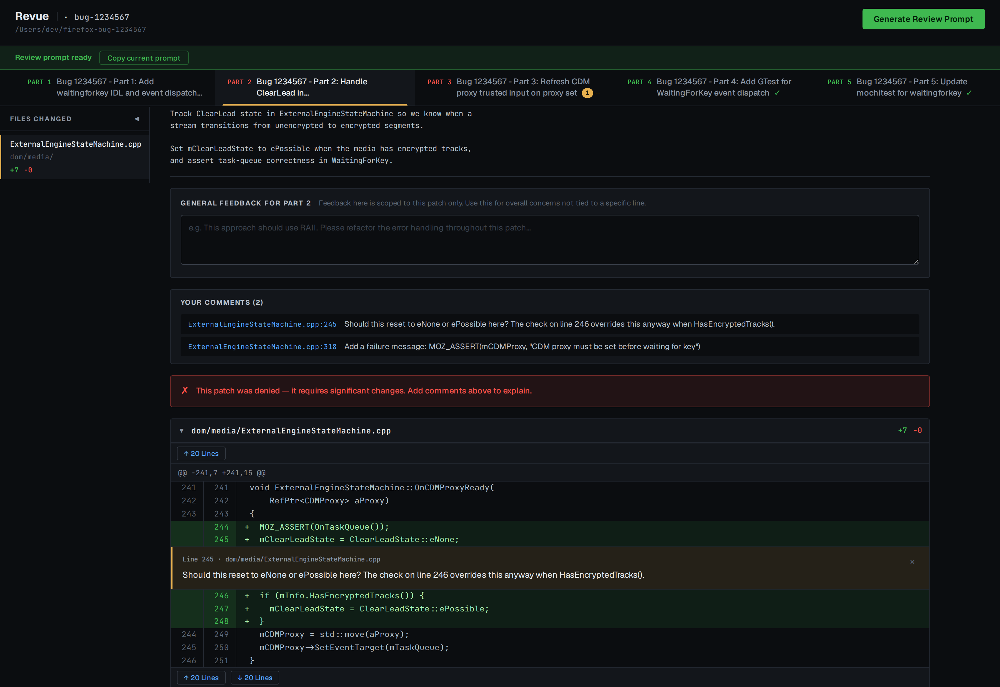

# Revue

> A local web UI for reviewing Git patch series and iterating on them with Claude — browse diffs, leave inline comments, generate a structured review prompt in one click.

<p align="center">
  <a href="https://alastor0325.github.io/revue/docs/">
    
  </a>
</p>

<p align="center">
  <a href="https://alastor0325.github.io/revue/docs/"><b>→ Try the interactive demo</b></a>
</p>

---

## Why

You asked Claude to ship a 6‑patch series. The diffs look right at a glance — but you want to leave a per‑line comment on Part 2, deny Part 3 entirely, approve Parts 4–5, and ask Claude to fix everything in one round trip. **Revue is that round trip.**

- One commit per tab. Click any diff line to comment.
- Approve / Deny per patch. Denied patches always appear in the prompt.
- Click **Generate Review Prompt** → markdown file written, prompt copied to clipboard, paste into Claude.
- Claude amends the commits. A banner appears. Reload, keep going. Approvals survive rebases.

---

## Quickstart

```bash
git clone https://github.com/alastor0325/revue
cd revue
npm install
npm link                          # makes `revue` available globally
revue init ~/path/to/your/repo    # tell it which repo is the default
revue                             # opens the browser
```

Requires **Node.js ≥ 18**.

---

## Features

| | |
|---|---|
| **Per-line comments** | Click any diff line or commit message to annotate. Drafts persist across reloads. |
| **Approve / Deny per patch** | Mark each commit. Denied patches always appear in the generated prompt — comment or no comment. |
| **Approval persistence** | Approvals survive page reloads, rebases, and commit-message amends. *Same code = same approval.* Only actual code changes clear an approval. |
| **Revision detection** | When commits are amended, a revision bar lets you compare old vs new diffs side-by-side. |
| **Multi-tab sync** | Open the same worktree in any number of tabs, browsers, or windows. Edits stream over Server-Sent Events; open forms are never clobbered by a peer save. |
| **Worktree switcher** | Running Claude in parallel on `myrepo-feature` and `myrepo-experiment`? Switch from the tab bar — no restart. |
| **Update banner** | Detects when Claude has pushed new commits to the worktree; click reload to pull them in without losing your session. |
| **Background daemon** | `revue` starts in the background and returns control immediately. `revue --stop` / `--restart` for lifecycle. |

---

## Workflow

```
        ┌─────────────────────────────────────────────────────┐
        │  1. Claude writes a patch series in a worktree      │
        │  2. revue my-feature  →  opens the UI               │
        │  3. Comment · Approve · Deny                        │
        │  4. Generate Review Prompt  →  prompt on clipboard  │
        │  5. Paste into Claude  →  Claude amends commits     │
        │  6. Update banner appears  →  Reload                │
        │  7. Loop until everything is approved               │
        └─────────────────────────────────────────────────────┘
```

---

## Configuration

`revue init <path>` writes `~/.revue/config.json` with a default repo. Run it again any time to change.

**Expected layout** (the directory names are how the worktree switcher labels them):

```
~/myrepo/               ← main repo
~/myrepo-feature/       ← a Claude-generated worktree
~/myrepo-experiment/    ← another worktree
```

Worktrees can live anywhere; `revue` discovers them from git's worktree registry.

---

## CLI

```bash
revue                              # default repo (from init)
revue --stop                       # stop the running daemon
revue --restart                    # restart (picks up server code changes)
revue --port 8080                  # custom port (default: 7777, auto-bumps if busy)
revue my-feature                   # open a specific worktree by name
revue --repo ~/other/repo          # override default repo for this run
revue --repo ~/other/repo feature  # override repo + worktree together
```

`<worktree-name>` is the directory basename with the repo prefix stripped (`myrepo-feature` → `feature`). If omitted, the server starts on the first registered worktree; switch any time using the worktree tabs at the top.

---

## Development

```bash
npm test              # run all non-UI tests (~400)
npm run test:ui       # run Playwright UI tests (~150)
npm run test:watch    # watch mode for non-UI tests
```

For live-reload dev mode:

```bash
REVUE_DAEMON=1 npm run dev -- my-feature
```

`nodemon` watches `src/`, `public/`, and `bin/`. `--no-open` is passed so the browser isn't re-opened on every restart — open it manually once, then refresh after each restart. (`revue --restart` is enough for one-off restarts when not actively editing code.)

**Docs:**
- [Reviewing reference](docs/reviewing.md) — full keyboard / interaction details
- [Client-side architecture](docs/architecture.md) — module layout, state mutator contract, revision detection

**Test coverage** — git parsing, all server API endpoints (with real git repos + real HTTP), per-field delta-write concurrency, SSE stream behavior, multi-tab sync regressions, worktree switching, revision migration, and the full browser UI driven by Chromium under Playwright.

---

## License

MIT
